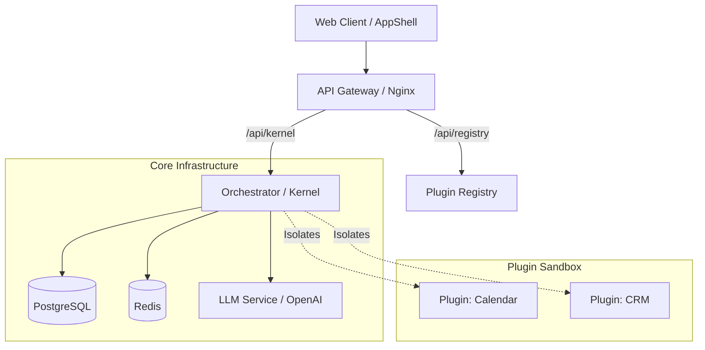

# Architecture Overview

## 1. Introduction
**Dhii Mail** is a "Liquid Workspace" that transforms traditional email into a dynamic, interactive operating system. This document outlines the high-level architecture, component interactions, and security model.

## 2. Core Concepts
*   **Liquid Workspace**: The UI is not a static set of pages but a dynamic composition of "Panes" and "Cards" generated by AI.
*   **Agent-to-UI (A2UI)**: A protocol where the backend (Agent) dictates the frontend (UI) structure via JSON schemas.
*   **Glass Wall**: A strict security boundary that isolates third-party plugins from the core kernel and user data.

## 3. System Architecture
The system follows a microservices architecture orchestrated by Kubernetes (or Docker Compose for local dev).

### 3.1 High-Level Diagram

### 3.2 Components
1.  **Web Client (AppShell)**:
    *   A "dumb" renderer that consumes JSON from the Orchestrator.
    *   Built with Web Components (@a2ui/lit) or React.
    *   Zero business logic; purely presentational.

2.  **API Gateway (Nginx)**:
    *   Single entry point for all client requests.
    *   Handles routing, SSL termination, and basic load balancing.
    *   Routes:
        *   `/api/kernel/*` -> Orchestrator
        *   `/api/registry/*` -> Plugin Registry

3.  **Orchestrator (Kernel)**:
    *   The "Brain" of the system.
    *   Generates UI layouts based on user intent and context.
    *   Manages plugin lifecycle and execution.
    *   Enforces the "Glass Wall" security policies.

4.  **Plugin Registry**:
    *   A catalog of available plugins.
    *   Serves plugin manifests (`manifest.json`) and assets.
    *   Verifies plugin signatures and permissions.

5.  **Data Layer**:
    *   **PostgreSQL**: Persistent storage for user data, plugin configurations, and conversation history.
    *   **Redis**: Caching layer for session state and real-time event pub/sub.

## 4. Data Flow (The A2UI Loop)
1.  **User Action**: User clicks a button or types a prompt in the AppShell.
2.  **Request**: AppShell sends an event (e.g., `{"type": "submit", "payload": "Schedule meeting"}`) to the Kernel.
3.  **Processing**:
    *   Kernel analyzes the intent.
    *   Kernel consults enabled plugins (e.g., Calendar Plugin).
    *   LLM constructs a response plan.
4.  **Response**: Kernel sends a JSON Schema (A2UI) back to the AppShell.
    *   Example: `{ "layout": "split-pane", "components": [...] }`
5.  **Rendering**: AppShell renders the new state without page reload.

## 5. Security Model: The Glass Wall
The **Glass Wall** is our primary defense mechanism.
*   **Sandboxing**: Plugins run in isolated environments (e.g., WebAssembly or restricted Python processes) with no direct access to the host or other plugins.
*   **Capability-Based Access**: Plugins must declare permissions (e.g., `calendar.read`) in their manifest. The user must explicitly grant these.
*   **Data Redaction**: The Kernel sanitizes data passing through the wall, stripping PII unless authorized.

## 6. Infrastructure
*   **Containerization**: All services are Dockerized.
*   **Orchestration**: Kubernetes manifests (`k8s/`) provided for production deployment.
*   **CI/CD**: GitHub Actions pipeline ensures code quality and build integrity.

## 7. Development Workflow
See [CONTRIBUTING.md](CONTRIBUTING.md) for detailed setup instructions.
*   **Local**: `docker-compose up` spins up the full stack.
*   **Testing**: `pytest` for backend, `npm test` for frontend.
